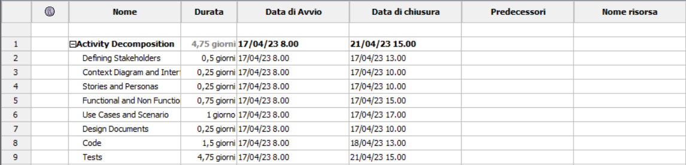
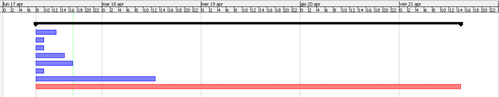

# Project Estimation - CURRENT
Date: 14/04/2023

Version:
| Version number | Change |
| ----------------- |:-----------|
| 1.0 | Estimation by Size, Product Decomposition, Activity Decomposition |
| 1.1 | Comparison of The Approaches, Gantt Diagram |

# Estimation approach
Consider the EZWallet  project in CURRENT version (as received by the teachers), assume that you are going to develop the project INDEPENDENT of the deadlines of the course
# Estimate by size
### 
|             | Estimate                        |             
| ----------- | ------------------------------- |  
| NC =  Estimated number of classes to be developed   |             54                |             
|  A = Estimated average size per class, in LOC       |             13               | 
| S = Estimated size of project, in LOC (= NC * A) | 702 |
| E = Estimated effort, in person hours (here use productivity 10 LOC per person hour)  |           70.2                           |   
| C = Estimated cost, in euro (here use 1 person hour cost = 30 euro) | 2.106 | 
| Estimated calendar time, in calendar weeks (Assume team of 4 people, 8 hours per day, 5 days per week ) |         0.43875           |               

# Estimate by product decomposition
### 
|         component name    | Estimated effort (person hours)   |             
| ----------- | ------------------------------- | 
|requirement document    | 11 |
| GUI prototype | 5 |
|design document | 4 |
|code | 11 |
| unit tests | 19 |
| api tests | 20 |
| management documents  | 4 |

# Estimate by activity decomposition
### 
|         Activity name    | Estimated effort (person hours)   |             
| ----------- | ------------------------------- | 
| Defining Stakeholders | 4 |
| Context Diagram and Interfaces | 2 |
| Stories and Personas | 2 |
| Functional and Non Functional Requirement | 6 |
| Use Cases and Scenario | 8 |
| Design Documents | 2 |
| code | 12 |
| tests | 38 |
###

# Summary

There is about 5% error between the approaches, since estimation is not perfect by definition.

|             | Estimated effort                        |   Estimated duration |          
| ----------- | ------------------------------- | ---------------|
| estimate by size | 70.2 | 0.43875 calendar weeks |
| estimate by product decomposition | 74 | 0.4625 calendar weeks |
| estimate by activity decomposition | 74 | 0.4625 calendar weeks |

