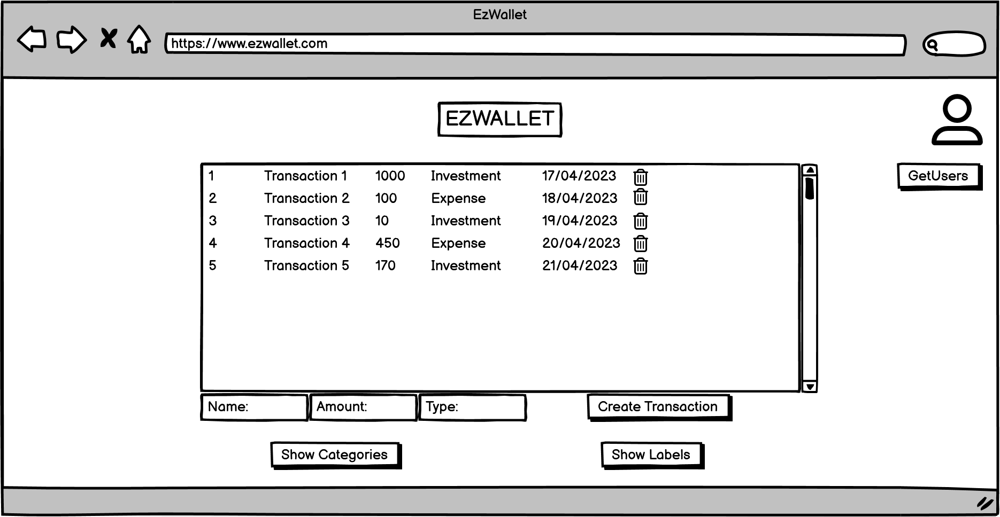
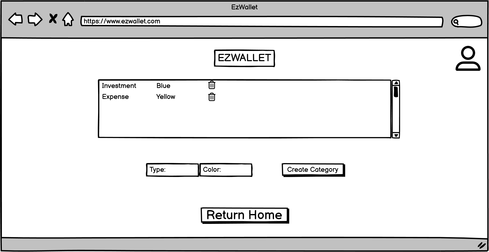

# Graphical User Interface Prototype  - FUTURE

Authors: Domenico Gagliardo, Agostino Saviano, Gaetano Roberto, Serigne Cheikh Fall

Date: 22/04/2023

Version: 2.0

# ACCESS PAGE
From here the User can enter E-Mail, Password. He can:
1) click the "Login" button to go to the [HOME PAGE USER](#home-page-user).
2) click on the "Login as Administrator" button to go to the [HOME PAGE ADMINISTRATOR](#home-page-administrator).
3) click on "not signed up? Create an Account" Link to go to the [CREATE ACCOUNT](#create-account).

# CREATE ACCOUNT
The non-registered User enters Username, E-Mail, Password and Confirm Password. After that, by clicking on the "Sign Up" button the User can go to the [HOME PAGE USER](#home-page-user).

# HOME PAGE USER
From here the User can see all the transactions. Here he can add a Transaction by clicking on "Create Transaction" button. He can also go to: 
1) [USER SETTINGS](#user-settings) by clicking on the settings icon.
2) [MANAGE CATEGORIES](#manage-categories) by clicking on the "Show Categories" button.
3) [MANAGE LABELS](#manage-labels) by clicking on the "Show Labels" button.   

  

# HOME PAGE ADMINISTRATOR
From here the Administrator can see all the transactions. Here he can add a Transaction by clicking on "Create Transaction" button. He can also go to: 
1) [USER SETTINGS](#user-settings) by clicking on the settings icon.
2) [USERS INFORMATION](#users-information) by clicking on the "GetUsers" button.
3) [MANAGE CATEGORIES](#manage-categories) by clicking on the "Show Categories" button.
4) [MANAGE LABELS](#manage-labels) by clicking on the "Show Labels" button. 

# USER SETTINGS
From here the User can see his account information (Username, e-mail and password). He can also go to :
1) [ACCESS PAGE ](#access-page) by clicking on the "Logout" button.
2) [HOME PAGE USER](#home-page-user) by clicking on the "Return Home" button if he is a normal user.
3) [MODIFY PASSWORD](#modify-password) by clicking on the "Modify password" button to change his password.
4) [HOME PAGE ADMINISTRATOR](#home-page-administrator) by clicking on the "Return Home" button if he is an administrator.

# USERS INFORMATION
From here the Administrator can see all  information of all the application users. He can also go to: 
1) [USER SETTINGS](#user-settings) by clicking on the settings icon.
2) [HOME PAGE ADMINISTRATOR](#home-page-administrator) by clicking on the "Return Home" button.

# MODIFY PASSWORD
From here the User can enter old password, new password and confirm new password.
He can go to:
1) [USER SETTINGS](#user-settings) by clicking on the "Confirm" button if he wants to save the new password or on the "Cancel" button if he wants to cancel the operation.

# MANAGE CATEGORIES
From here the User can see all the categories. He can also add a category by clicking on the "Create Category" button or cancel a category by clicking on the "Trash" icon . He can  go to: 
1) [USER SETTINGS](#user-settings) by clicking on the settings icon.
2) [HOME PAGE USER](#home-page-user) by clicking on the "Return Home" button if he is a normal user.
3) [HOME PAGE ADMINISTRATOR](#home-page-administrator) by clicking on the "Return Home" button if he is an administrator.

# MANAGE LABELS
From here the User can see all the labels. He can also go to: 
1) [USER SETTINGS](#user-settings) by clicking on the settings icon.
2) [HOME PAGE USER](#home-page-user) by clicking on the "Return Home" button if he is a normal user.
3) [HOME PAGE ADMINISTRATOR](#home-page-administrator) by clicking on the "Return Home" button if he is an administrator.

