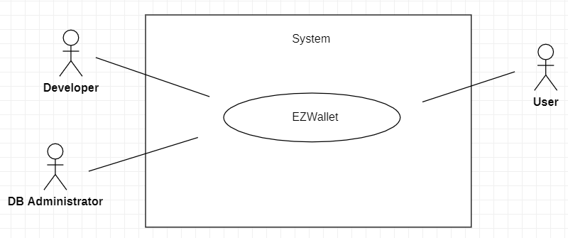

# Requirements Document - current EZWallet

Date: 

Version: V1 - description of EZWallet in CURRENT form (as received by teachers)

 
| Version number | Change |
| ----------------- |:-----------|
| | | 

# Contents

- [Informal description](#informal-description)
- [Stakeholders](#stakeholders)
- [Context Diagram and interfaces](#context-diagram-and-interfaces)
	+ [Context Diagram](#context-diagram)
	+ [Interfaces](#interfaces) 
	
- [Stories and personas](#stories-and-personas)
- [Functional and non functional requirements](#functional-and-non-functional-requirements)
	+ [Functional Requirements](#functional-requirements)
	+ [Non functional requirements](#non-functional-requirements)
- [Use case diagram and use cases](#use-case-diagram-and-use-cases)
	+ [Use case diagram](#use-case-diagram)
	+ [Use cases](#use-cases)
    	+ [Relevant scenarios](#relevant-scenarios)
- [Glossary](#glossary)
- [System design](#system-design)
- [Deployment diagram](#deployment-diagram)

# Informal description
EZWallet (read EaSy Wallet) is a software application designed to help individuals and families keep track of their expenses. Users can enter and categorize their expenses, allowing them to quickly see where their money is going. EZWallet is a powerful tool for those looking to take control of their finances and make informed decisions about their spending.

# Stakeholders

| Stakeholder name  | Description | 
| ----------------- |:-----------:|
|   StakeHolder1: Owner    |    investor, owns the product     |
|   StakeHolder2: User    |    person interested in charting its expenses      |
|   StakeHolder5: DB Administrator    |    person in charge of managing the DB     |
|   StakeHolder6: Developer   | person in charge of developing the software product  |
|   StakeHolder7: Server   | TODO |

# Context Diagram and interfaces

## Context Diagram

## Interfaces
| Actor | Logical Interface | Physical Interface  |
| ------------- |:-------------:| -----:|
|   Developer     | PC | Developing Suite Tools (VSCode, NodeJS, ...) |
|   DB Administrator     | PC | MongoDB Graphical User Interface |
|   User     | Smartphone/PC | Graphical User Interface (to be defined) |
|   Server     | Internet connection | NodeJS API |

# Stories and personas
- Persona 1: High income professional, male, married, with no children, 40 yo
	+ Story: He thought that invest into this type of application could be profitable. Every month he checks how the project is going.
- Persona 2: Professional, female, divorced, with children, 40 yo
	+ Story: She needs to monitor her expenses, interested in understanding where her money has been spent.
- Persona 3: Student, worker part-time, male, 22, low income
	+ Story: Off-campus student interested in managing his finances better, since he has a part-time job but monthly expenses.
- Persona 4: Student, female, 22, no income 
	+ Story: Student Offsite, interested in managing the money her family sends her.
- Persona 5: Young professional, female, 30, with very high skills in DB management
	+ Story: Graduated with 110 e Lode at the Politecnico Di Torino, specializing in business information systems, subsequently hired for the management of software data. 
- Persona 6: professional, male, married, with children, 50 yo
	+ Story: Web application field expert, with knowledge about the frontend and backend. Proficient with Javascript and able to develop an application very well.

# Functional and non functional requirements

## Functional Requirements

\<In the form DO SOMETHING, or VERB NOUN, describe high level capabilities of the system>

\<they match to high level use cases>

| ID        | Description  |
| ------------- |:-------------:| 
|  FR1     |  |
|  FR2     |   |
| FRx..  | | 

## Non Functional Requirements

\<Describe constraints on functional requirements>

| ID        | Type (efficiency, reliability, ..)           | Description  | Refers to |
| ------------- |:-------------:| :-----:| -----:|
|  NFR1     |   |  | |
|  NFR2     | |  | |
|  NFR3     | | | |
| NFRx .. | | | | 

# Use case diagram and use cases

## Use case diagram
\<define here UML Use case diagram UCD summarizing all use cases, and their relationships>

\<next describe here each use case in the UCD>
### Use case 1, UC1
| Actors Involved        |  |
| ------------- |:-------------:| 
|  Precondition     | \<Boolean expression, must evaluate to true before the UC can start> |
|  Post condition     | \<Boolean expression, must evaluate to true after UC is finished> |
|  Nominal Scenario     | \<Textual description of actions executed by the UC> |
|  Variants     | \<other normal executions> |
|  Exceptions     | \<exceptions, errors > |

##### Scenario 1.1 

\<describe here scenarios instances of UC1>

\<a scenario is a sequence of steps that corresponds to a particular execution of one use case>

\<a scenario is a more formal description of a story>

\<only relevant scenarios should be described>

| Scenario 1.1 | |
| ------------- |:-------------:| 
|  Precondition     | \<Boolean expression, must evaluate to true before the scenario can start> |
|  Post condition     | \<Boolean expression, must evaluate to true after scenario is finished> |
| Step#        | Description  |
|  1     |  |  
|  2     |  |
|  ...     |  |

##### Scenario 1.2

##### Scenario 1.x

### Use case 2, UC2
..

### Use case x, UCx
..

# Glossary

\<use UML class diagram to define important terms, or concepts in the domain of the application, and their relationships> 

\<concepts must be used consistently all over the document, ex in use cases, requirements etc>

# System Design
\<describe here system design>

\<must be consistent with Context diagram>

# Deployment Diagram 

\<describe here deployment diagram >

