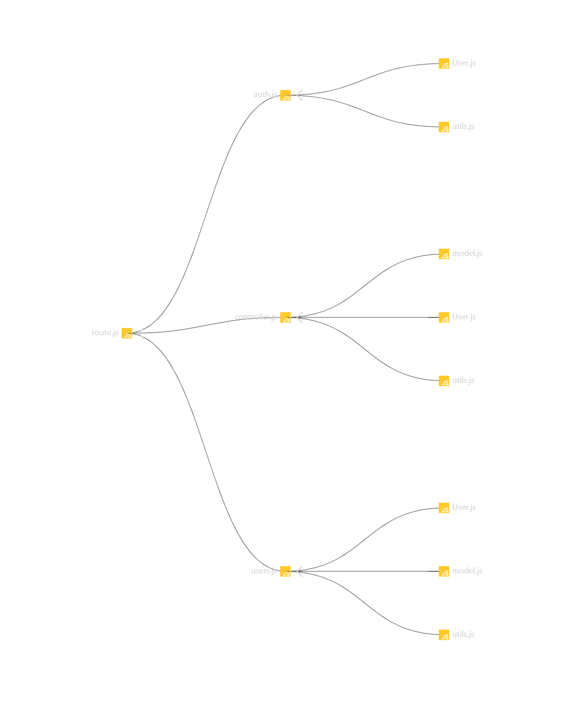

# Test Report

<The goal of this document is to explain how the application was tested, detailing how the test cases were defined and what they cover>

# Contents

- [Dependency graph](#dependency-graph)

- [Integration approach](#integration-approach)

- [Tests](#tests)

- [Coverage](#Coverage)

# Dependency graph 
## Main Dependency Graph

### Auth.js

### Controller.js

### Users.js

### Utils.js

# Integration approach

    <Write here the integration sequence you adopted, in general terms (top down, bottom up, mixed) and as sequence
    (ex: step1: unit A, step 2: unit A+B, step 3: unit A+B+C, etc)> 
    <Some steps may  correspond to unit testing (ex step1 in ex above)>
    <One step will  correspond to API testing, or testing unit route.js>
    
    We first started from unit testing by testing progressively all the functions, then we moved towards integration testing. For integration testing, we followed more or less the same approach, so we wrote progressively all the integration tests for all the functions.

# Tests

   <in the table below list the test cases defined For each test report the object tested, the test level (API, integration, unit) and the technique used to define the test case  (BB/ eq partitioning, BB/ boundary, WB/ statement coverage, etc)>   <split the table if needed>

## auth.unit.test
| Test case name | Object(s) tested | Test level | Technique used |
|--|--|--|--|
|Register an User, should register it with success|register|unit|WB/Statement Coverage|
|Register an User with missing body parameters, should return 400|register|unit|WB/Statement Coverage|
|Register an User with empty string body parameters, should return 400|register|unit|WB/Statement Coverage|
|Register an User with wrong email format, should return 400|register|unit|WB/Statement Coverage|
|Register an User, username already existing, should return 400|register|unit|WB/Statement Coverage|
|Register an User, email already existing, should return 400|register|unit|WB/Statement Coverage|
|Register an Admin, should register it with success|registerAdmin|unit|WB/Statement Coverage|
|Register an Admin with missing body parameters, should return 400|registerAdmin|unit|WB/Statement Coverage|
|Register an Admin with empty string body parameters, should return 400|registerAdmin|unit|WB/Statement Coverage|
|Register an Admin with wrong email format, should return 400|registerAdmin|unit|WB/Statement Coverage|
|Register an Admin, username already existing, should return 400|registerAdmin|unit|WB/Statement Coverage|
|Register an Admin, email already existing, should return 400|registerAdmin|unit|WB/Statement Coverage|
|User Login, should register it with success|login|unit|WB/Statement Coverage|
|User Login with not all necessary attributes, should return 400|login|unit|WB/Statement Coverage|
|User Login with at least one of the parameters in the request body as an empty string, should return 400|login|unit|WB/Statement Coverage|
|User Login with the email not in a valid format, should return 400|login|unit|WB/Statement Coverage|
|User Login with the email in the request body that does not identify a user in database, should return 400|login|unit|WB/Statement Coverage|
|User Login with the password that does not match with the one in the database, should return 400|login|unit|WB/Statement Coverage|
|User Logout, should logout with success|logout|unit|WB/Statement Coverage|
|User Logout with no refresh token in the request, should return with 400|logout|unit|WB/Statement Coverage|
|User Logout with the refresh token that does not represent a user in the database, should return with 400|logout|unit|WB/Statement Coverage|
## controller.unit.test
| Test case name | Object(s) tested | Test level | Technique used |
|--|--|--|--|
|Should return the created category|createCategory|unit|WB/Statement Coverage|
|Should return error if the request body does not contain all the necessary attributes|createCategory|unit|WB/Statement Coverage|
|Should return error if at least one of the parameters in the request body is an empty string|createCategory|unit|WB/Statement Coverage|
|Should return error if the type of category passed in the request body represents an already existing category in the database|createCategory|unit|WB/Statement Coverage|
|Should return error if called by an authenticated user who is not an admin (authType = Admin)|createCategory|unit|WB/Statement Coverage|
|Should update category successfully and return also the number of transactions whose type changed|updateCategory|unit|WB/Statement Coverage|
|Should return error if the request body does not contain all the necessary attributes|updateCategory|unit|WB/Statement Coverage|
|Should return error if at least one of the parameters in the request body is an empty string|updateCategory|unit|WB/Statement Coverage|
|Should return error if the type of category passed as a route parameter does not represent a category in the database|updateCategory|unit|WB/Statement Coverage|
|Should return error if the type of category passed in the request body as the new type represents an already existing category in the database and that category is not the same as the requested one|updateCategory|unit|WB/Statement Coverage|
|Should return error if called by an authenticated user who is not an admin (authType = Admin)|updateCategory|unit|WB/Statement Coverage|
|Should delete successfully the given categories N > T|deleteCategory|unit|WB/Statement Coverage|
|Should delete successfully the given categories N == T|deleteCategory|unit|WB/Statement Coverage|
|Should return error if the array passed in the request body is empty|deleteCategory|unit|WB/Statement Coverage|
|Should return error if the request body does not contain all the necessary attributes|deleteCategory|unit|WB/Statement Coverage|
|Should return error if called when there is only one category in the database|deleteCategory|unit|WB/Statement Coverage|
|Should return error if at least one of the types in the array is an empty string|deleteCategory|unit|WB/Statement Coverage|
|Should return error if at least one of the types in the array does not represent a category in the database|deleteCategory|unit|WB/Statement Coverage|
|Should return error if called by an authenticated user who is not an admin (authType = Admin)|deleteCategory|unit|WB/Statement Coverage|
|Should return all the categories on database|getCategories|unit|WB/Statement Coverage|
|Should return error if called by a user who is not authenticated (authType = Simple)|getCategories|unit|WB/Statement Coverage|
|Should return a 200 response and save the transaction for authorized user with valid data|createTransaction|unit|WB/Statement Coverage|
|should return a 400 error if the request body does not contain all the necessary attributes|createTransaction|unit|WB/Statement Coverage|
|should return a 400 error if at least one of the parameters in the request body is an empty string|createTransaction|unit|WB/Statement Coverage|
|should return a 400 error if the username passed in the request body is not equal to the one passed as a route parameter|createTransaction|unit|WB/Statement Coverage|
|should return a 400 error if the username passed in the request body does not represent a user in the database|createTransaction|unit|WB/Statement Coverage|
|should return a 400 error if the amount passed in the request body cannot be parsed as a floating value|createTransaction|unit|WB/Statement Coverage|
|should return a 400 error if the category passed in the request body does not exists|createTransaction|unit|WB/Statement Coverage|
|should return a 401 error if called by an authenticated user who is not the same user as the one in the route parameter|createTransaction|unit|WB/Statement Coverage|
|should return transactions with category information for Admin (200)|getAllTransactions|unit|WB/Statement Coverage|
|should return error for non-admin users (401)|getAllTransactions|unit|WB/Statement Coverage|
|should return error for unexpected errors (500)|getAllTransactions|unit|WB/Statement Coverage|
|should return transactions with status code 200|getTransactionsByUser|unit|WB/Statement Coverage|
|should return transactions with status code 200 as Admin (without filtering)|getTransactionsByUser|unit|WB/Statement Coverage|
|username passed as a route parameter does not represent a user in the database, should return 400|getTransactionsByUser|unit|WB/Statement Coverage|
|authenticated user who is not the same user as the one in the route (authType = User), should return 401|getTransactionsByUser|unit|WB/Statement Coverage|
|authenticated user who is not an admin (authType = Admin), should return 401|getTransactionsByUser|unit|WB/Statement Coverage|
|should return transactions with status code 200|getTransactionsByUserByCategory|unit|WB/Statement Coverage|
|username passed as a route parameter does not represent a user in the database, should return 400|getTransactionsByUserByCategory|unit|WB/Statement Coverage|
|category passed as a route parameter does not represent a category in the database, should return 400|getTransactionsByUserByCategory|unit|WB/Statement Coverage|
|authenticated user who is not the same user as the one in the route (authType = User), should return 401|getTransactionsByUserByCategory|unit|WB/Statement Coverage|
|authenticated user who is not an admin (authType = Admin), should return 401|getTransactionsByUserByCategory|unit|WB/Statement Coverage|
|should return 200|getTransactionsByGroup|unit|WB/Statement Coverage|
|group not found in the database, should return 400|getTransactionsByGroup|unit|WB/Statement Coverage|
|user not part of the group (authTupe=Group), should return 401|getTransactionsByGroup|unit|WB/Statement Coverage|
|user not an Admin (authTupe=Admin), should return 401|getTransactionsByGroup|unit|WB/Statement Coverage|
|getTransactionsByGroupByCategory, should return 200|getTransactionsByGroupByCategory|unit|WB/Statement Coverage|
|getTransactionsByGroupByCategory with group not found in the database, should return 400|getTransactionsByGroupByCategory|unit|WB/Statement Coverage|
|getTransactionsByGroupByCategory with category not found in the database, should return 400|getTransactionsByGroupByCategory|unit|WB/Statement Coverage|
|getTransactionsByGroupByCategory with user not in the group, should return 401|getTransactionsByGroupByCategory|unit|WB/Statement Coverage|
|getTransactionsByGroupByCategory with user not an admin, should return 401|getTransactionsByGroupByCategory|unit|WB/Statement Coverage|
|deleteTransaction, should delete the transaction with success|deleteTransaction|unit|WB/Statement Coverage|
|deleteTransaction with body that does not contain all the necessary attributes, should return 400|deleteTransaction|unit|WB/Statement Coverage|
|deleteTransaction with id in the request body that is an empty string, should return 400|deleteTransaction|unit|WB/Statement Coverage|
|deleteTransaction with username passed as a route parameter that does not represent a user in the database, should return 400|deleteTransaction|unit|WB/Statement Coverage|
|deleteTransaction with the _id in the request body that does not represent a transaction in the database, should return 400|deleteTransaction|unit|WB/Statement Coverage|
|deleteTransaction with the _id in the request body that represents a transaction made by a different user than the one in the route, should return 400|deleteTransaction|unit|WB/Statement Coverage|
|deleteTransaction called by an authenticated user who is not the same user as the one in the route (authType = User), should return 401|deleteTransaction|unit|WB/Statement Coverage|
|deleteTransactions, should delete all transactions with success|deleteTransactions|unit|WB/Statement Coverage|
|deleteTransactions with body without all necessary attributes, should return 400|deleteTransactions|unit|WB/Statement Coverage|
|deleteTransactions with at least one of the ids in the array is an empty string, should return 400|deleteTransactions|unit|WB/Statement Coverage|
|deleteTransactions with at least one of the ids in the array does not represent a transaction in the database, should return 400|deleteTransactions|unit|WB/Statement Coverage|
|deleteTransactions not called by an Admin, should return 401|deleteTransactions|unit|WB/Statement Coverage|
## controller.unit.test
| Test case name | Object(s) tested | Test level | Technique used |
|--|--|--|--|
|Should return the created category|createCategory|unit|WB/Statement Coverage|
## utils.unit.test
| Test case name | Object(s) tested | Test level | Technique used |
|--|--|--|--|
|Should return the correct filter object when filtering by date|handleDateFilterParams|unit|WB/Statement Coverage|
|Should return the correct filter object when filtering by upTo|handleDateFilterParams|unit|WB/Statement Coverage|
|Should return the correct filter object when filtering by from|handleDateFilterParams|unit|WB/Statement Coverage|
|Should return the correct filter object when filtering from a date to an other|handleDateFilterParams|unit|WB/Statement Coverage|
|Should return an empty object when no query parameters are passed|handleDateFilterParams|unit|WB/Statement Coverage|
|Should throws an error when are present both date and from |handleDateFilterParams|unit|WB/Statement Coverage|
|Should throws an error when are present both date and upTo |handleDateFilterParams|unit|WB/Statement Coverage|
|Should throws an error when are present  date, from and upTo|handleDateFilterParams|unit|WB/Statement Coverage|
|should throw an error when date is not valid|handleDateFilterParams|unit|WB/Statement Coverage|
|should throw an error when upTo is not valid|handleDateFilterParams|unit|WB/Statement Coverage|
|should throw an error when from is not valid|handleDateFilterParams|unit|WB/Statement Coverage|
|should throw an error when from or upTo are not valid but both defined|handleDateFilterParams|unit|WB/Statement Coverage|
|Should return the correct result when authentication is successful using Simple authType|verifyAuth|unit|WB/Statement Coverage|
|Should not return the correct result when authentication is not successful using Simple authType|verifyAuth|unit|WB/Statement Coverage|
|Should return non authorized when accessToken or  refreshToken are not both defined|verifyAuth|unit|WB/Statement Coverage|
|Should return non authorized when accessToken has missing information|verifyAuth|unit|WB/Statement Coverage|
|Should return non authorized when refreshToken has missing information|verifyAuth|unit|WB/Statement Coverage|
|should return the correct result when authentication is successful using User authType and matching username|verifyAuth|unit|WB/Statement Coverage|
|should return "Mismatched users" when accessToken have a username different from the requested one using User authType|verifyAuth|unit|WB/Statement Coverage|
|should return "Mismatched users" when accessToken have a username different from the requested one using User authType|verifyAuth|unit|WB/Statement Coverage|
|should return "Mismatched users" when refreshToken have a username different from the requested one using User authType|verifyAuth|unit|WB/Statement Coverage|
|should return "Token Expired: Mismatched users" when access token is expired and mismatched users for Regular authType|verifyAuth|unit|WB/Statement Coverage|
|should return the correct result when access token is expired and the refreshToken has a username equal to the requested one for Regular authType|verifyAuth|unit|WB/Statement Coverage|
|Should return the correct result when authentication is successful using Admin authType|verifyAuth|unit|WB/Statement Coverage|
|Should return "Admin: Mismatched role" when the accessToken have a role which is not Admin using Admin authType|verifyAuth|unit|WB/Statement Coverage|
|Should return "Admin: Mismatched role" when the refreshToken have a role which is not Admin using Admin authType|verifyAuth|unit|WB/Statement Coverage|
|Should return non authorized when accessToken is expired and  the refreshToken have a role which is not Admin using Admin authType|verifyAuth|unit|WB/Statement Coverage|
|Should return authorized when accessToken is expired and the refreshToken have a role which is Admin using Admin authType|verifyAuth|unit|WB/Statement Coverage|
|should return Authorized when accessToken and  refreshToken have a email which is in group for Group authType|verifyAuth|unit|WB/Statement Coverage|
|should return not Authorized when accessToken has a email which is not in group for Group authType|verifyAuth|unit|WB/Statement Coverage|
|should return not Authorized when refreshToken has a email which is not in group for Group authType|verifyAuth|unit|WB/Statement Coverage|
|should return not Authorized when accessToken is expired and  refreshToken has a email which is not in group for Group authType|verifyAuth|unit|WB/Statement Coverage|
|should return Authorized when accessToken is expired and  refreshToken has a email which is in group for Group authType|verifyAuth|unit|WB/Statement Coverage|
|should return not Authorized when access and refresh token are both expired (Simple)|verifyAuth|unit|WB/Statement Coverage|
|should return not Authorized when access and refresh token are both expired (Group)|verifyAuth|unit|WB/Statement Coverage|
|should return the correct filter object when filtering by min amount only|handleAmountFilterParams|unit|WB/Statement Coverage|
|should return the correct filter object when filtering by max amount only|handleAmountFilterParams|unit|WB/Statement Coverage|
|should return the correct filter object when filtering by min and max amount|handleAmountFilterParams|unit|WB/Statement Coverage|
|should throw an error when min value is not valid|handleAmountFilterParams|unit|WB/Statement Coverage|
|should throw an error when max value is not valid|handleAmountFilterParams|unit|WB/Statement Coverage|
|should throw an error when max or min are not valid but are both defined|handleAmountFilterParams|unit|WB/Statement Coverage|
|should return an empty object when max and min are not defined|handleAmountFilterParams|unit|WB/Statement Coverage|

# Coverage

## Coverage of FR

<Report in the following table the coverage of  functional requirements (from official requirements) >

| Functional Requirements covered |   Test(s) | 
| ------------------------------- | ----------- | 
| FRx                             |             |             
| FRy                             |             | 
| ... ||

## Coverage white box

Report here the screenshot of coverage values obtained with jest-- coverage 

